# SmartReach AI 🚀

<div align="center">

**Autonomous AI-Powered HR Cold Outreach, Resume Attachment & Email Dispatch Platform**

[](https://www.python.org/)
[](https://fastapi.tiangolo.com/)
[](https://react.dev/)
[](https://www.typescriptlang.org/)
[](https://vitejs.dev/)
[](https://tailwindcss.com/)
[](https://www.mongodb.com/)
[](LICENSE)

*Automate personalized cold emails to recruiters with resume parsing, contact deduplication, multi-tone AI copy synthesis, human-in-the-loop review, and rate-limited background SMTP dispatch with attached PDF resumes.*

[Architecture](#-system-architecture) • [ER Diagram](#-database-entity-relationship-er-diagram) • [Automation Pipelines](#-automation--pipeline-diagrams) • [Screenshots](#-platform-walkthrough--screenshots) • [Quick Start](#-quick-start-guide) • [SMTP Setup](#-smtp-configuration-guide) • [API Reference](#-api-endpoints-reference)

---

</div>

## 📌 Overview

**SmartReach AI** automates job candidate outreach from resume ingestion to live email delivery:

- 📄 **Resume Ingestion**: Parses candidate profile, skills, projects, and work history from PDF/DOCX files.
- 👥 **Recruiter Data Engine**: Imports CSV/Excel contacts, validates email syntax, and filters duplicates.
- ⚡ **AI Personalization**: Dynamically synthesizes high-converting email copy matched to recruiter title and company.
- ✍️ **Human Review Workspace**: Inline editor with reading time estimates, word counts, and bulk approvals.
- 📬 **Live SMTP Engine with Resume Attachments**: Dispatches emails with attached PDF resumes using anti-spam human jitter delays (0.2s–0.8s) and configurable daily caps.
- 🧪 **Zero-Risk Sandbox**: Test full campaigns safely in simulation mode before going live.

---

## 🏛️ System Architecture

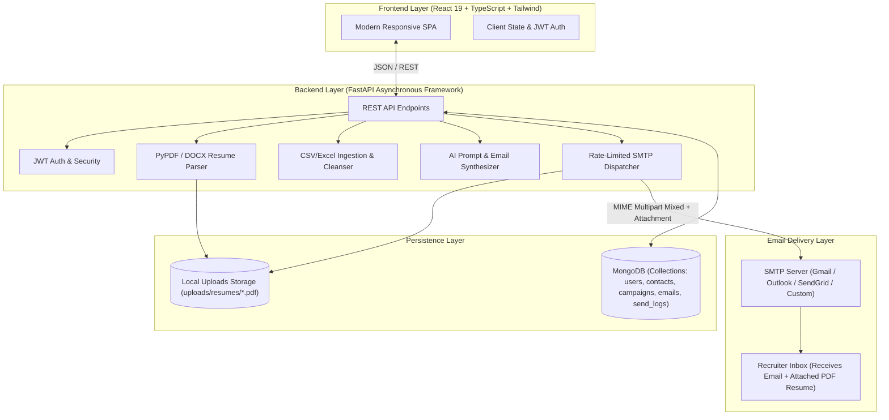

---

## 🗄️ Database Entity-Relationship (ER) Diagram

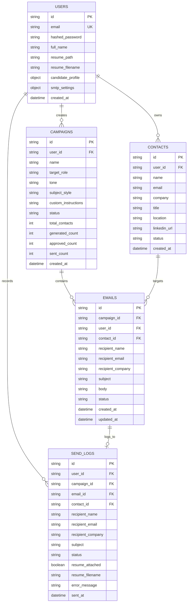

---

## 🔄 Automation & Pipeline Diagrams

### 1. End-to-End Campaign Outreach Sequence

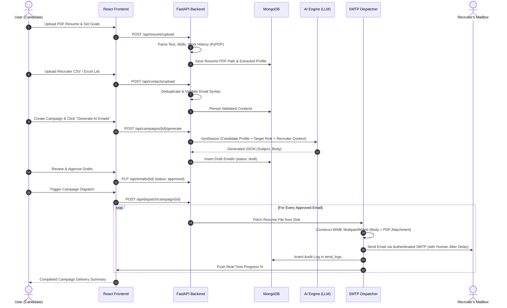

---

### 2. Campaign State Machine & Lifecycle Flow

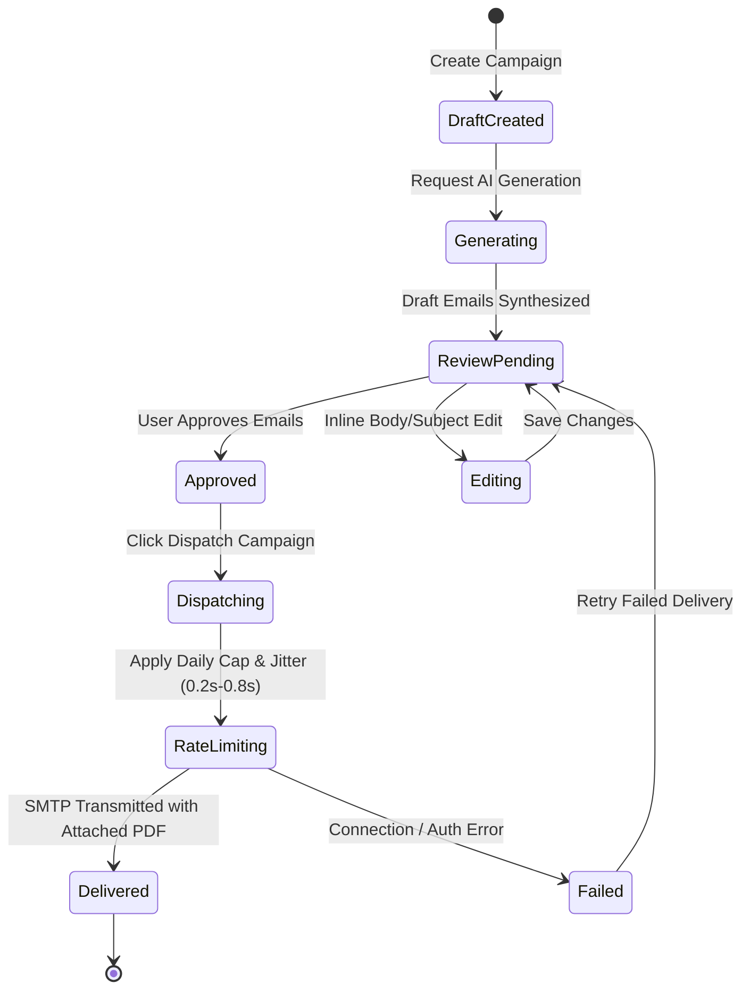

---

### 3. Contact Ingestion & Data Cleansing Pipeline

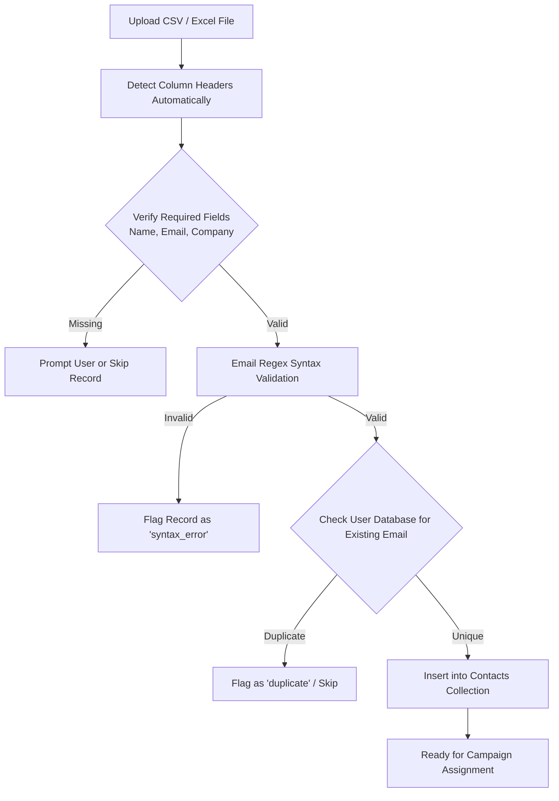

---

### 4. Background SMTP Dispatch & Resume Attachment Pipeline

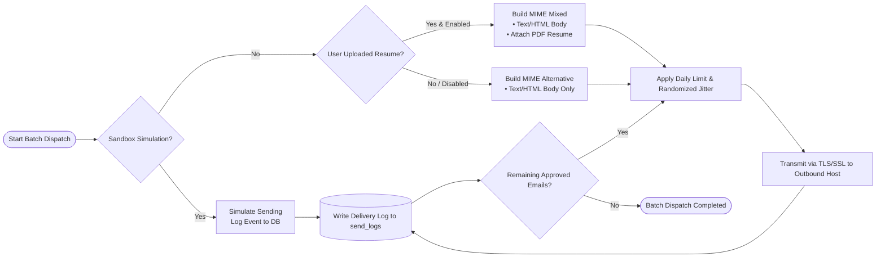

---

## 📸 Platform Walkthrough & Screenshots

### 1. Landing Page
Modern hero section introducing automated outreach capabilities.
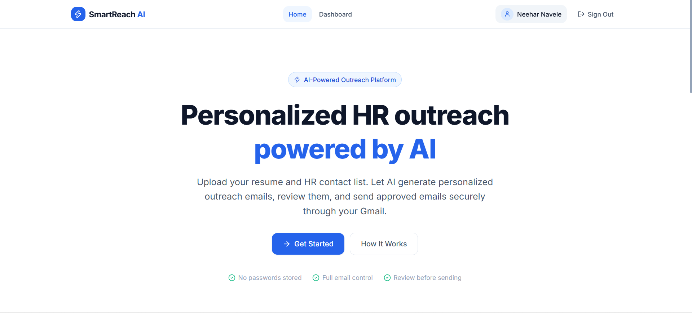

---

### 2. Analytics Dashboard
Live metrics tracking total contacts, active campaigns, generated drafts, approval ratios, and delivery rates.
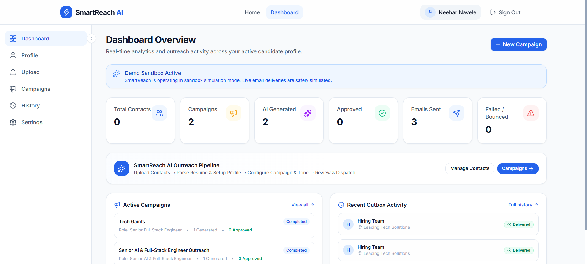

---

### 3. Recruiter Contacts Management
Spreadsheet upload zone with automated header detection, email syntax validation, and duplicate filtering.
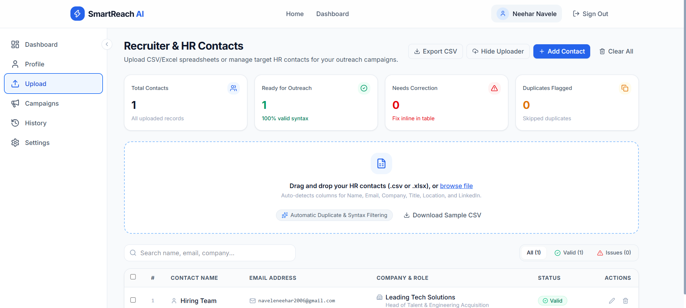

---

### 4. Outreach Campaigns Hub
Create targeted outreach campaigns, select customized tones, track generation progress, and launch review workspaces.
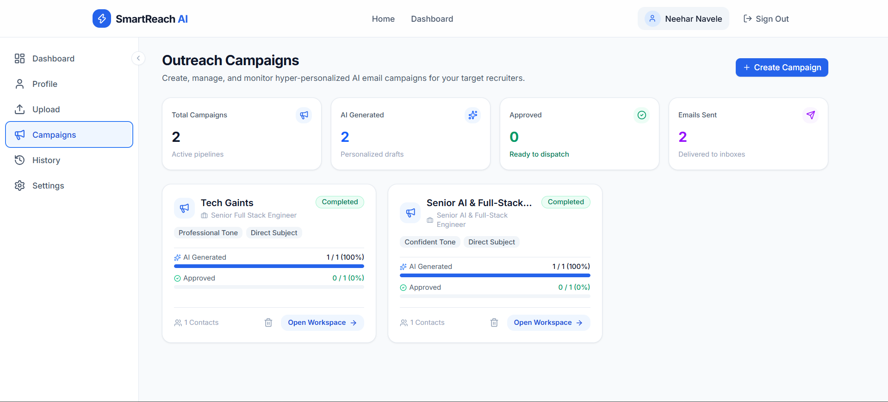

---

### 5. SMTP Settings & Inbox Safeguards
Configure outbound email servers (Gmail, Outlook 365, SendGrid, Custom SMTP), set daily rate limits, and toggle Sandbox Simulation Mode.
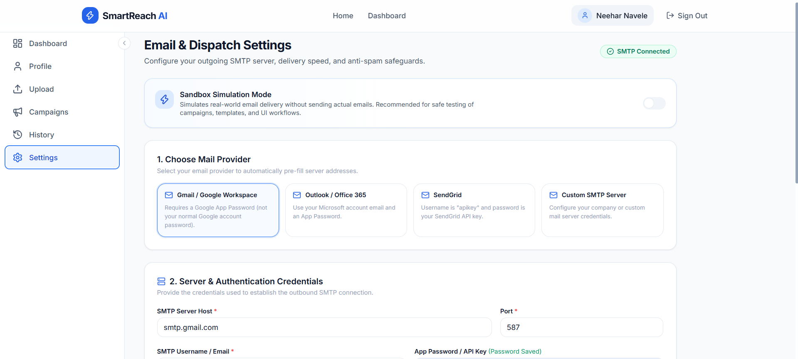

---

### 6. Outreach History & Delivery Audit Trail
Audit all outbound messages with exact timestamps, recruiter information, delivery statuses (*Delivered, Simulated, Failed*), and exportable CSV reports.
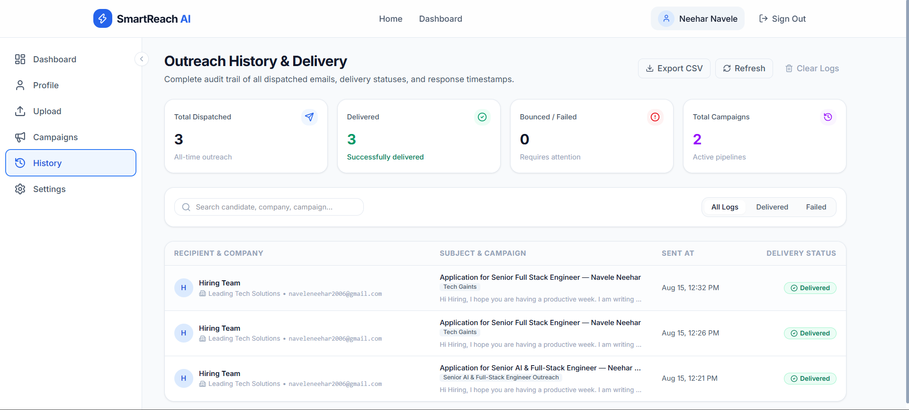

---

## ⚡ Core Features

| Feature | Description |
|---|---|
| 📄 **Resume Parser** | Ingests `.pdf` / `.docx` resumes and structures candidate profile, skills, experience, and links. |
| 📎 **PDF Resume Attachments** | Automatically attaches the candidate's PDF resume to outgoing emails during live SMTP delivery. |
| 👥 **Contact Management** | Smart CSV/Excel import with automated header mapping, regex validation, and deduplication. |
| 🤖 **Multi-Tone AI Engine** | Writes tailored cold emails matching candidate qualifications to company needs across 4 tones. |
| ✍️ **Review Workspace** | Full rich editor with live word count, reading time estimates, inline editing, and 1-click approvals. |
| 🛡️ **Anti-Spam Controls** | Configurable daily limits (5–250/day) and humanized random jitter (0.2s–0.8s) to protect sender reputation. |
| 🧪 **Sandbox Simulation** | Zero-risk testing mode to rehearse campaign workflows without sending real emails. |
| 📊 **History & Audit Logs** | Complete delivery logs with timestamps, recipient avatars, company tags, and one-click CSV export. |

---

## 🛠️ Technology Stack

| Layer | Technologies |
|---|---|
| **Frontend** | React 19, TypeScript, Vite, Tailwind CSS, Lucide Icons, Axios |
| **Backend** | Python 3.10+, FastAPI, Pydantic v2, Uvicorn |
| **Database** | MongoDB (Motor Async Client) |
| **Document Processing** | PyPDF, python-docx, Pandas, OpenPyXL |
| **Email Protocol** | Python `smtplib`, `email.mime` (Multipart Mixed + Application) |
| **Containerization** | Docker, Docker Compose, Nginx |

---

## 🚀 Quick Start Guide

### Prerequisites
- **Python**: 3.10+
- **Node.js**: 18+ & npm
- **MongoDB**: Local instance running on port `27017` or MongoDB Atlas URI

---

### Method 1: Local Development Setup

#### 1. Clone the Repository
```bash
git clone https://github.com/<your-username>/smartreach-ai.git
cd smartreach-ai
```

#### 2. Backend Setup
```bash
cd backend

# Create and activate virtual environment
python -m venv venv

# Windows (Git Bash / PowerShell):
source venv/Scripts/activate     # or .\venv\Scripts\activate

# macOS / Linux:
source venv/bin/activate

# Install Python packages
pip install -r requirements.txt

# Configure environment variables
cp ../.env.example .env
```

#### 3. Frontend Setup
```bash
# In a new terminal window:
cd frontend
npm install
npm run dev
```

#### 4. Start the Backend Server
```bash
cd backend
uvicorn app.main:app --reload --port 8000
```

- **Frontend App**: `http://localhost:5173` (or `http://localhost:5174`)
- **API Swagger Docs**: `http://localhost:8000/docs`

---

### Method 2: One-Click Windows Launcher
Double-click `run_dev.bat` in the project root:
```cmd
run_dev.bat
```

---

### Method 3: Docker Compose
```bash
docker-compose up --build -d
```
Access the application at `http://localhost:3000`.

---

## 📧 SMTP Configuration Guide

### Gmail / Google Workspace:
1. Open **Google Account Security**: `https://myaccount.google.com/security`
2. Enable **2-Step Verification**.
3. Generate an **App Password**: `https://myaccount.google.com/apppasswords`
4. Select App Name: `SmartReach` and copy the generated 16-character code.
5. In SmartReach AI (`/settings`):
   - **Provider**: `Gmail / Google Workspace`
   - **SMTP Host**: `smtp.gmail.com` | **Port**: `587`
   - **Username**: Your Gmail address
   - **App Password**: Paste your 16-character App Password
   - **Security**: Enable STARTTLS
6. Click **Test Connection** → **Save Settings**.

---

## 🔌 API Endpoints Reference

| Method | Route | Description |
|---|---|---|
| `POST` | `/api/auth/register` | Register new user account |
| `POST` | `/api/auth/login` | Login and obtain JWT token |
| `GET` | `/api/profile` | Retrieve candidate profile |
| `PUT` | `/api/profile` | Update candidate profile & target roles |
| `POST` | `/api/resume/upload` | Upload and parse PDF/DOCX resume |
| `GET` | `/api/contacts` | List contacts with filtering & search |
| `POST` | `/api/contacts/upload` | Ingest contacts from CSV/Excel file |
| `DELETE`| `/api/contacts` | Delete all uploaded contacts |
| `GET` | `/api/campaigns` | List outreach campaigns |
| `POST` | `/api/campaigns` | Create new campaign |
| `POST` | `/api/campaigns/{id}/generate` | Generate AI email drafts |
| `GET` | `/api/emails/campaign/{id}` | Fetch generated emails for review |
| `PUT` | `/api/emails/{id}` | Edit email content or update approval status |
| `POST` | `/api/emails/campaign/{id}/approve-all` | Approve all drafts in campaign |
| `POST` | `/api/dispatch/campaign/{id}` | Trigger background SMTP email delivery |
| `GET` | `/api/dispatch/campaign/{id}/status` | Check real-time dispatch progress |
| `GET` | `/api/history` | Retrieve delivery audit logs |
| `GET` | `/api/history/export` | Export delivery logs as CSV |
| `GET` | `/api/settings/smtp` | Get current SMTP & dispatch settings |
| `PUT` | `/api/settings/smtp` | Update SMTP credentials & attachment settings |
| `POST` | `/api/settings/smtp/test` | Test live SMTP server connectivity |

---

## 📄 License

This project is licensed under the **MIT License** — see the [LICENSE](LICENSE) file for details.
